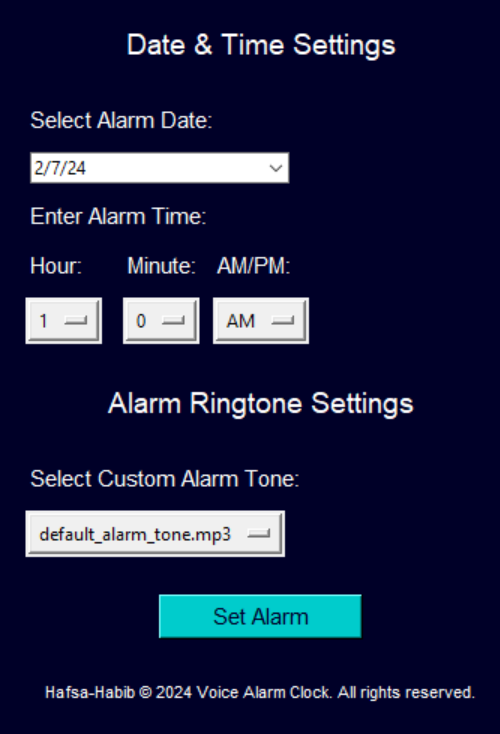

<h1>Python Advanced - Project 1</h1>
<h2>Alarm Clock - Mini Project</h2> 
 
The Voice Alarm Clock project is a mini app created using Python and the Tkinter library, which enables the creation of user graphical interfaces. Its main purpose is to provide users with the ability to set alarms by choosing their preferred date, time and alarm sound through a interface./br>
 
<b>Features:</b> 
<ul> 
<li>Date & Time Settings: Users can select the alarm date, hour, minute, and AM/PM designation.</li> 
<li>Select Alarm Tone: Users have the option to choose from a list of pre-defined and custom alarm tones</li> 
<li>Voice Feedback: The application provides voice feedback to confirm the alarm settings once they are configured.</li> 
<li>Alarm Ringing: Once the alarm is set, the application waits until the specified time and then plays the selected alarm tone.</li> 
</ul> 
<b>Alarm Clock - GUI</b> 

