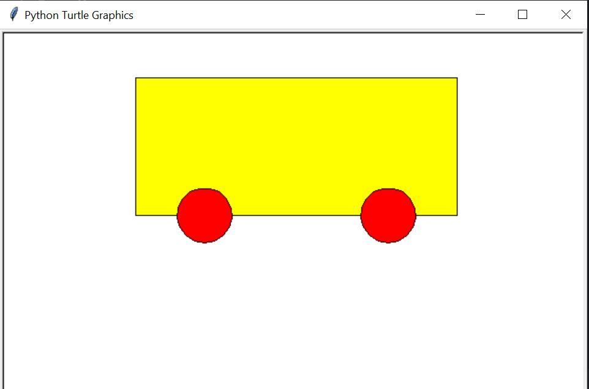
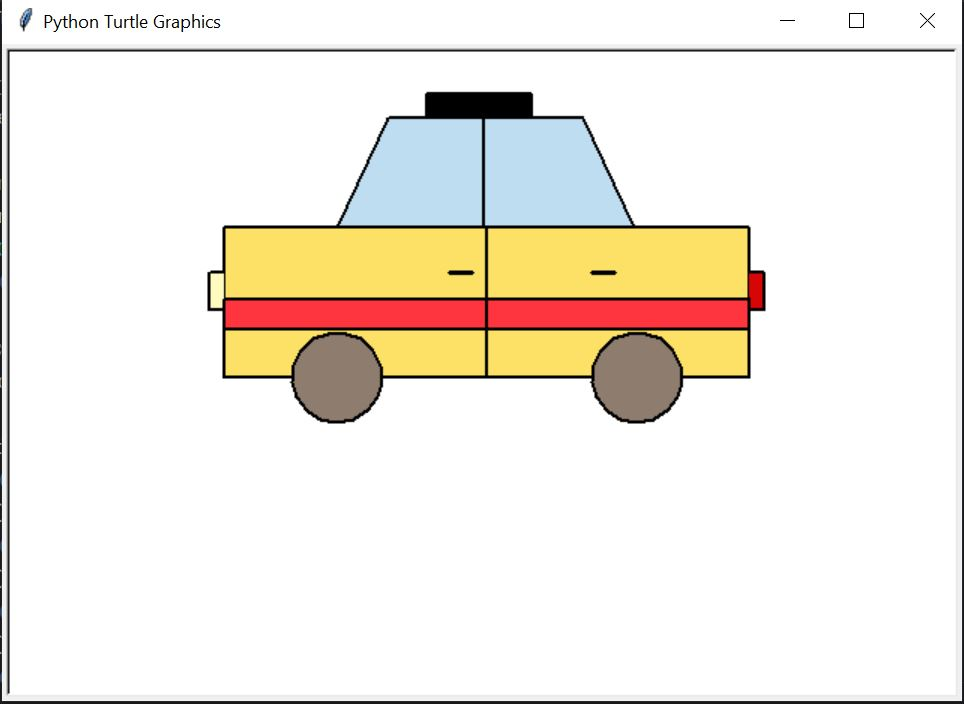
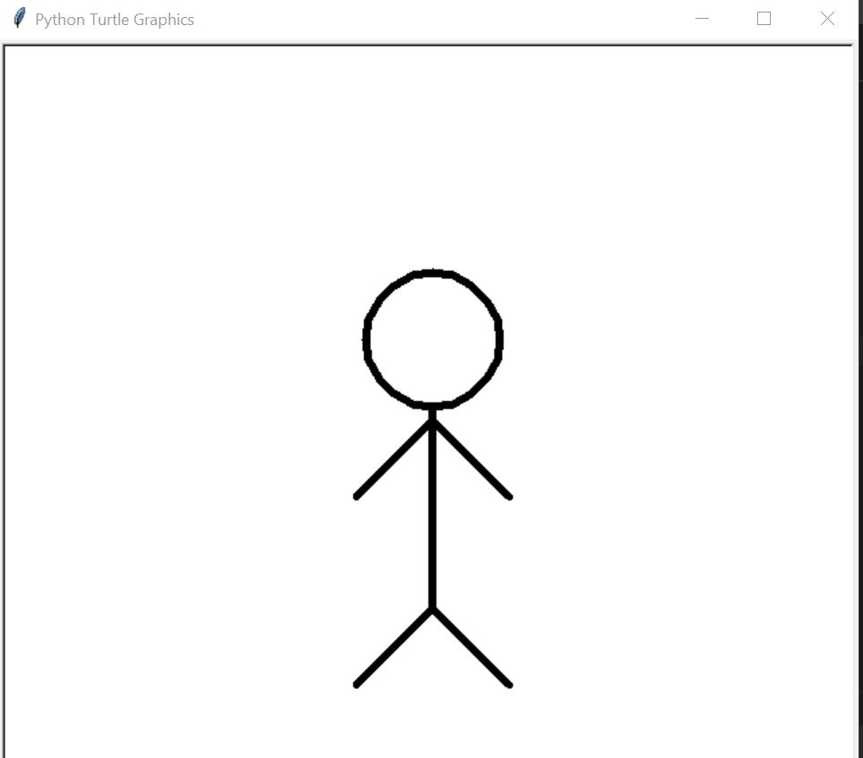

<h1>Python Advanced Assignment - 2</h1>

<b>Task-1:</b> 
Create a Python Turtle Graphics program that generates a bus model:  
<b>Output-1:</b> 

<b>Task-2:</b> 
Create a Python Turtle Graphics program that generates a taxi model:  
<b>Output-2:</b> 

<b>Task-3: </b> 
Createa Python Turtle Graphics program that generates a human model:  
<b>Output-3:</b> 

