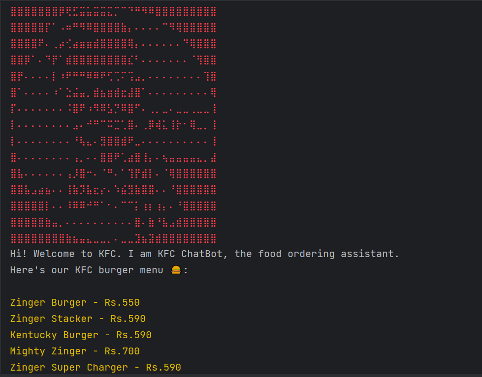
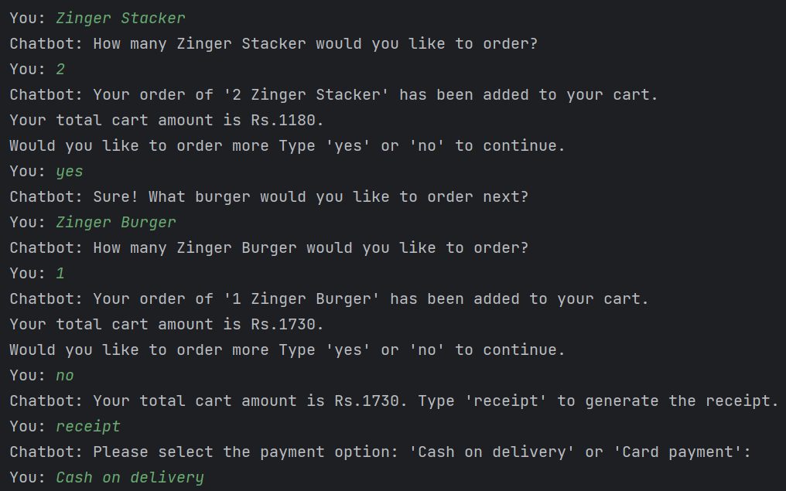
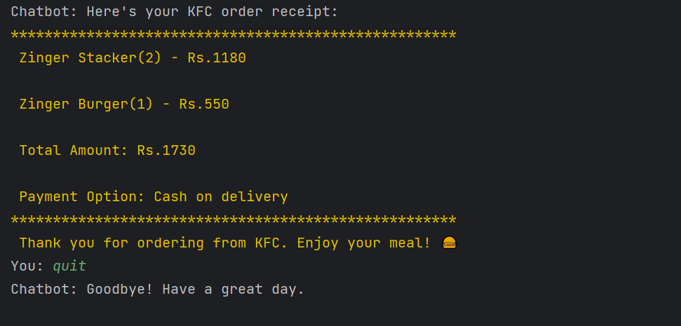

Assignment Title: Build a Basic KFC Online Order Chatbot
The objective of this assignment is to create a beginner-level chatbot that can take online orders for KFC items, specifically focusing on burgers. This assignment will help you understand the basics of creating a chatbot that interacts with users, collects order details, and provides a user-friendly ordering experience.

Create a list of KFC burger items with their names and prices. At a minimum, include three different burger options
Greet the user.
Present the available burger options with their prices.
Take the user's order, including the burger name and quantity.
Calculate the total cost of the order.
Provide a summary of the order before confirming.
Confirm the order and thank the user.
Offer payment options or generate an order receipt.

