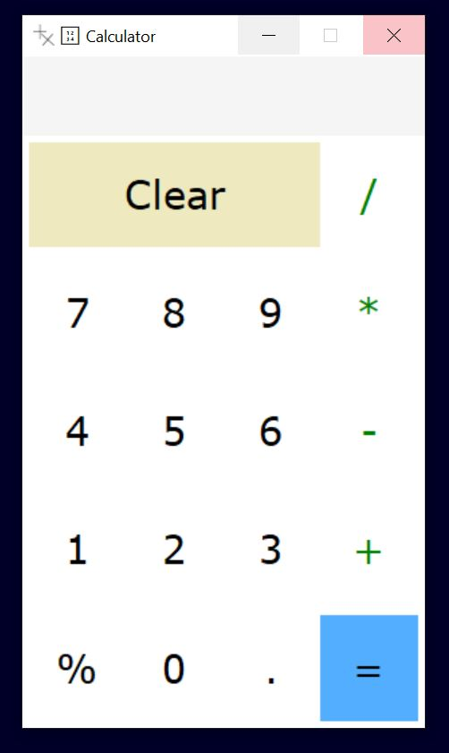

<h1>Python Advanced Assignment - 5</h1>
<h2> Python tkinter library</h2> 
 
<b>Assignment:</b> 
Design or develop a simple calculator using the Python tkinter library. Your calculator must have at least four functions, including addition, multiplication, subtraction, and division.  
<b>Output:</b> 
