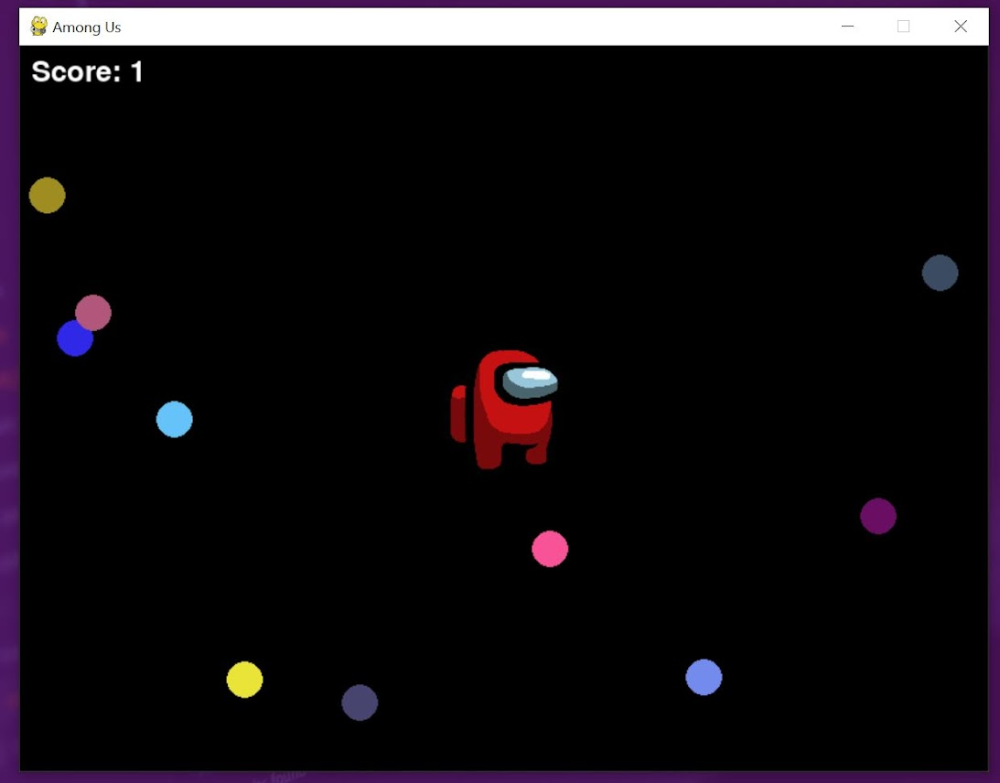
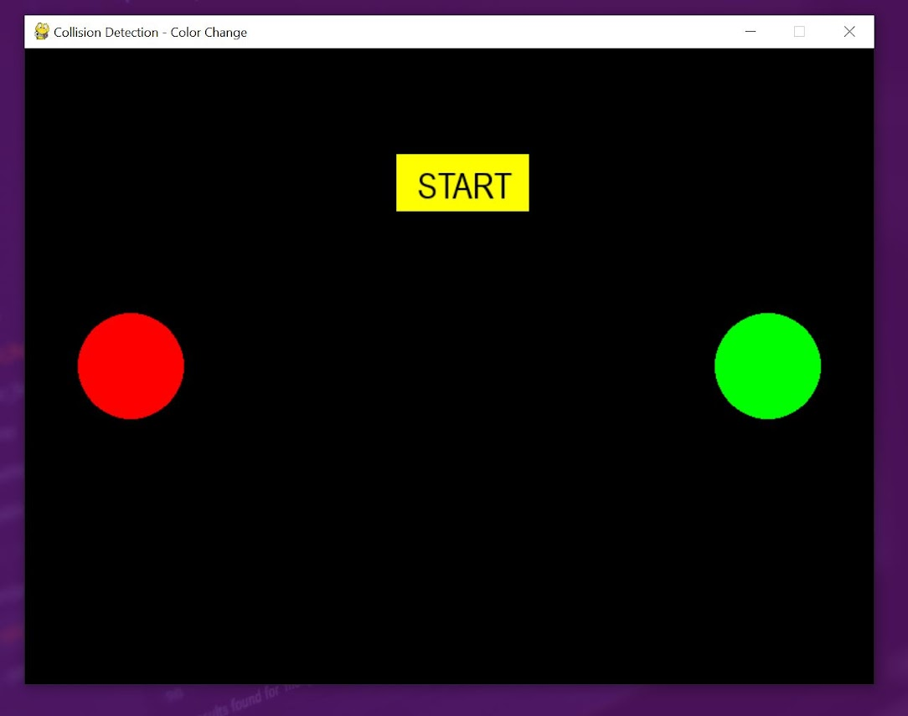

<h1>Python Advanced Assignment - 6</h1>
<h2>Python Pygame</h2>

<b>Task-1: Adding Images</b> 
Display Images Using PyGame load and display images within a PyGame window. Load an image using PyGame.Display the image in the PyGame window.Use keyboard inputs to move the object (e.g., arrow keys for movement)  
<b>Output-1: [File: CollectObjectsGame.py]</b> 

<b>Task-2: Collision Detection</b> 
Implement Basic Collision Detection to detect collisions between objects within a PyGame window. Create multiple objects (e.g., rectangles or circles). Implement collision detection between these objects.Display a message or change the color of the colliding objects upon collision.  
<b>Task-3: Sound Effects</b> 
Implement Sound Effects Using PyGame add sound effects to  PyGame projects. Load a sound file using PyGame.Play the sound at specific events e.g., when an object collides.  
<b>Output-2 & 3: [File: collisionDetection.py]</b> 
