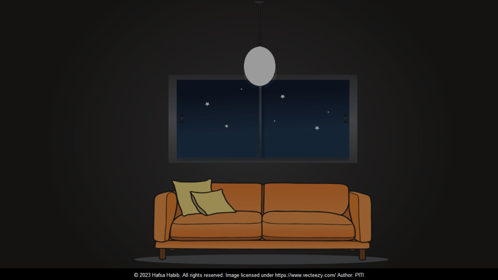

<h1>Blink Light Using Tkinter</h1>

<h2>Project Description </h2>

The "Blink Light" project is a simple Python application built with Tkinter that simulates the blinking of a light, switching between an "on" and "off" state at regular intervals. This project provides a basic demonstration of how to create graphical user interfaces (GUIs) and implement dynamic behavior using Tkinter, Python's standard GUI toolkit.

<h2>Project GUI</h2>

 
