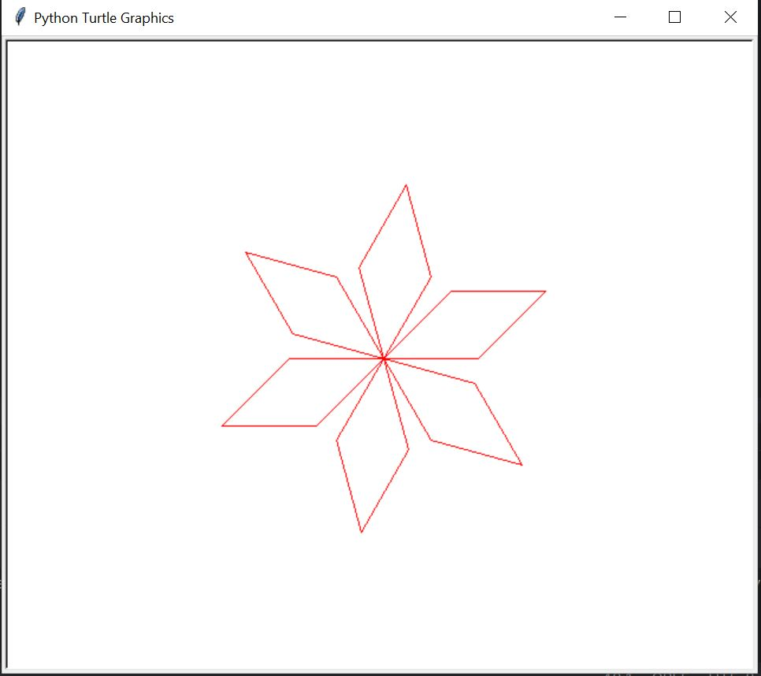

<h1>Python Problems</h1>

<h2>Problem 1: Word Reversal </h2>

Create a program that reverses a word entered by the user using the input() function.   
1. Prompt the user to input a word. 
2. Reverse the input word. 
3. Display the reversed word to the user. 

<h3>Output</h3>

<h2>Problem 2: Temperature Converter</h2>

Create a program that converts temperatures between Celsius and Fahrenheit based on user input.  
1. Ask the user to input a temperature value. 
2. Ask the user to specify whether the temperature is in Celsius or Fahrenheit. 
3. Convert the temperature to the other unit (if it's in Celsius, convert it to Fahrenheit, and vice versa). 
4. Display the converted temperature to the user.  
 
<b>Note:</b> 
Use the conversion formulas: Celsius to Fahrenheit: F=9/5×C+32 
Fahrenheit to Celsius: C=5/9×(F−32) 

<h3>Output</h3>

<h2>Problem 3: Birthday Wishes</h2>

Creating a personalized birthday wish using the gTTS & playsound library.  
Note: Program will ask your name when you enter the name, it will generate the 
personalized birthday wish and play it using your system's default audio player.

<h2>Problem 4: Screen Color Changing</h2>

<b>Problem:</b> 
Design a basic PyGgame screen that changes its color randomly every 2 seconds. 
<b>Instructions:</b> 
Using the Pygame library in Python, create a window that displays a solid color. 
Initially, the window should display a starting color. However, every 2 seconds, the 
background color should change to a new random color. The program should 
continue running until manually closed.

<h3>Output</h3>

<h2>Problem 5: Draw Basic Flower Shape</h2>

<b>Problem:</b> 
Using the Python Turtle graphics library, create a progrm to draw a basic 
flower shape. The function should take parameters for the number of petals, the 
length of each petal, and the color of the flower. The flower should be drawn at 
the center of the screen.

<h3>Output</h3>

<h2>Problem 6:Class & Object</h2>

<b>Problem:</b> 
Design a University class and create four different department objects (e.g., 
Computer Science, Mathematics, Biology, and Literature) that are instances of this 
University class. Each department should have unique attributes and methods 
associated with it.

