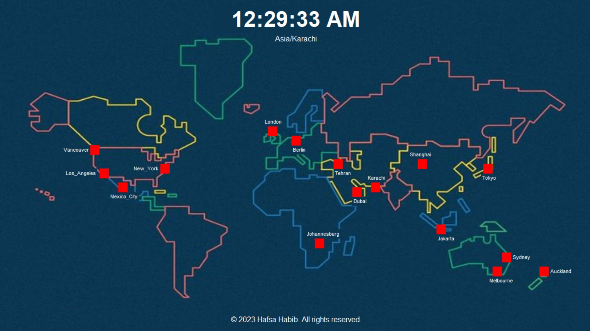

<h1>World Clock Project</h1>

<h2>Project Description </h2>

The Python-based World Clock project aims to provide users with a convenient way to view current times across different time zones around the globe. This project leverages Python's simplicity and versatility to create a user-friendly application that displays real-time information, making it useful for individuals who frequently collaborate or communicate with people in various locations worldwide.

<h2>Features</h2>
<ol>
    <li>Multi-Time Zone Display</li>
    <li>User-Friendly Interface</li>
    <li>World Map Display</li>
</ol>

<h2>Project GUI</h2>

